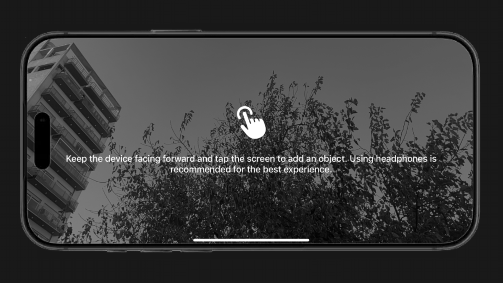
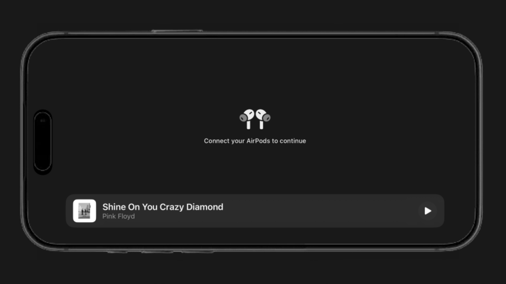
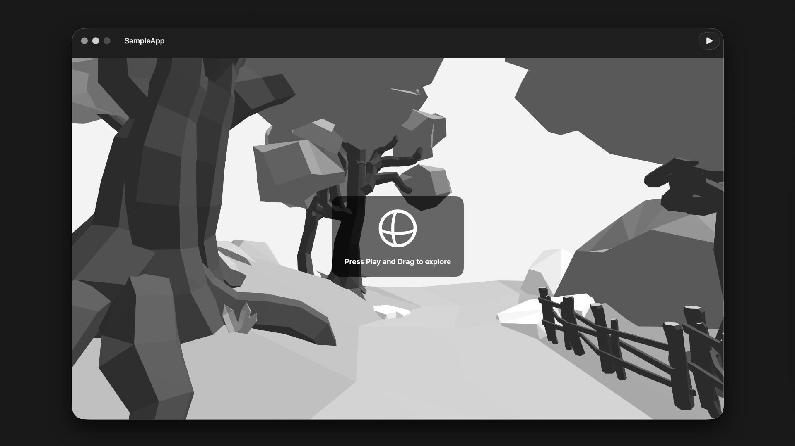
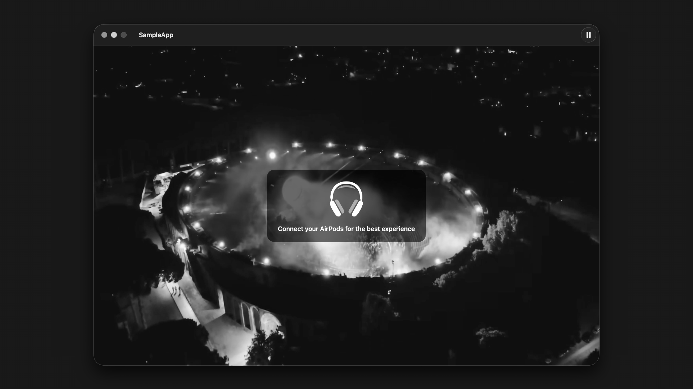
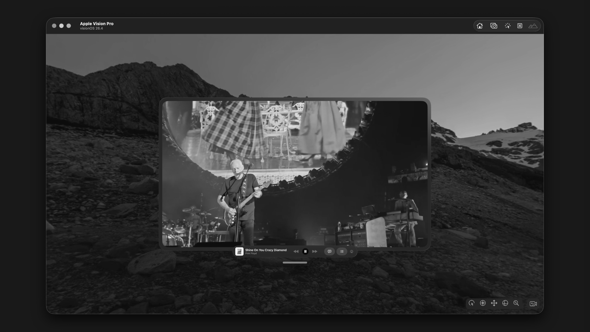
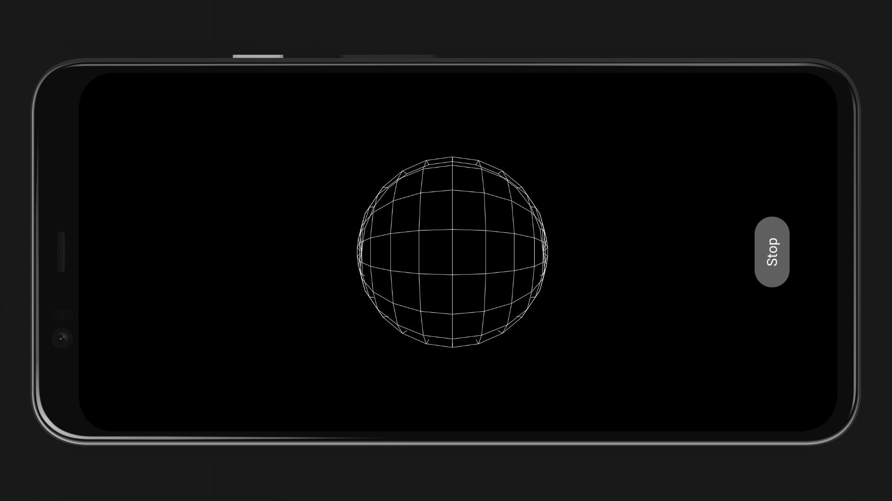

#### Overview

I/O is a **multiplatform audio graph engine**, written entirely in ***Swift***, designed to offer a flexible and high-performance system for creating, processing, and routing audio in real time. This directory collects separate showcase projects, demos, and experimental applications built around the engine for educational and exploratory purposes. Each sample is intended to make a specific integration scenario easier to inspect, run, and adapt, from mobile and desktop playback flows to spatial, head-tracked, immersive, and Android-oriented experiments.

These projects are not the primary product documentation; the repository root README and documentation resources remain the reference for installation, distribution, and core concepts. Instead, this area is focused on practical learning: comparing platform implementations, validating feature ideas, demonstrating integration patterns, and providing compact app-level examples that help developers understand how I/O behaves in real application contexts.

#### Preview (`/augmented-ios`)

This sample runs I/O on **iOS** as a mobile experience focused on real-time graph execution, source playback, and interactive parameter updates. It shows how routing and processing nodes can be adjusted during runtime while preserving low-latency behavior in a production-like app flow.

#### Preview (`/headtracking-ios`)

This sample extends the iOS flow with **head-tracking** driven binaural rendering, combining live graph processing with motion-responsive spatial updates. It demonstrates how listener orientation can influence the signal path in real time, making playback feel anchored and immersive.

#### Preview (`/immersive-audio-macos`)

This sample presents I/O on **macOS** for a 360-oriented desktop scenario, exposing configurable playback, routing, and processing controls. It is designed for experimentation with graph composition and spatial behavior in a controlled environment where parameters can be tuned continuously.

#### Preview (`/headtracking-macos`)

This sample showcases a **macOS** head-tracking workflow where binaural rendering reacts to listener movement while the graph remains fully configurable. It highlights real-time adaptation of the audio scene, useful for validating responsive spatial mixes on desktop hardware.

#### Preview (`/immersive-audio-visionOS`)

This sample runs I/O on **visionOS** with an immersive interface that combines spatial media playback and real-time graph processing. It demonstrates how audio sources, routing nodes, and scene interaction can work together in mixed-reality experiences with dynamic updates.

#### Preview (`/experimental-android`)

This sample demonstrates I/O on **Android** through the COMMUNITY AAR integration, showing client-side playback, asset loading, and graph coordination from a native Android app. It provides a compact reference for validating the Android distribution and testing real-time audio behavior outside the Apple platform samples.

#### License

This project is distributed under a license that allows its use, modification, and distribution, provided that the specified terms are respected (http://opensource.org/licenses/mit-license.php)

Copyright © 2019 - 2027 - ***Comdigis***, *Buenos Aires, Argentina*.
